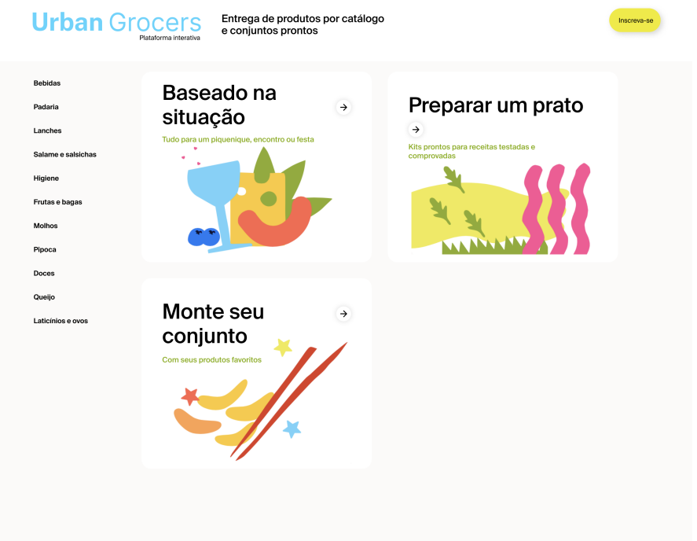

# Urban Grocers

___
No aplicativo Urban.Grocers, realizei testes específicos para validar as APIs da plataforma, garantindo que as requisições e respostas fossem processadas corretamente, assegurando a integridade dos dados e a funcionalidade esperada.

**Detalhes do Teste:**

- Requisições POST para Adicionar Produtos a Kits:

  - Verifiquei a adição de produtos a kits existentes por meio de uma requisição POST para */api/v1/kits/:id/products.* Testei diferentes cenários, incluindo adição de múltiplos produtos, validação de IDs e campos obrigatórios, e tratamento de erros quando os parâmetros não estavam corretos.

**Exemplo de casos de teste:**
***Adicionar produtos existentes a um kit:*** Verifiquei se a adição de produtos funcionava corretamente, retornando status 200 OK.
***Envio de requisição sem o corpo (body) da solicitação:*** Esperava um retorno 400 Bad Request, mas o sistema retornou 500 Internal Server Error, indicando um problema no tratamento de erros, e foi reportado como bug.
***Validação de parâmetros inválidos:*** Testei o envio de IDs com caracteres especiais, letras, ou campos vazios, esperando sempre um 400 Bad Request. Em muitos desses casos, a API retornou 500 Internal Server Error, o que indica falhas na validação e foi reportado.
***Validação de Custos de Entrega:*** Realizei requisições POST para validar os custos de entrega por meio da API */order-and-go/v1/delivery*, verificando diferentes combinações de tempo de entrega, quantidade e peso dos produtos.
***Validar entrega com produtos em quantidades negativas ou zero:*** Testei para garantir que tais casos fossem corretamente identificados como inválidos, esperando um 400 Bad Request, mas em vários casos a API retornou 200 OK, o que reportei como bug pela ferramenta GIRA.

**Ferramentas Utilizadas:**

- ***Postman:*** Utilizado para criar e enviar as requisições API, analisando as respostas e comportamentos da API em diferentes cenários.
- ***JIRA:*** Ferramenta utilizada para documentar e rastrear os bugs encontrados durante os testes, garantindo que os problemas fossem corrigidos antes da implementação final.

Os testes revelaram vários pontos de melhoria, especialmente no tratamento de erros e na validação dos dados de entrada. A documentação completa dos testes, incluindo os resultados e os bugs reportados, foi crucial para garantir que a API do Urban.Grocers estivesse pronta para lidar com diferentes cenários de uso de maneira robusta e eficiente.
